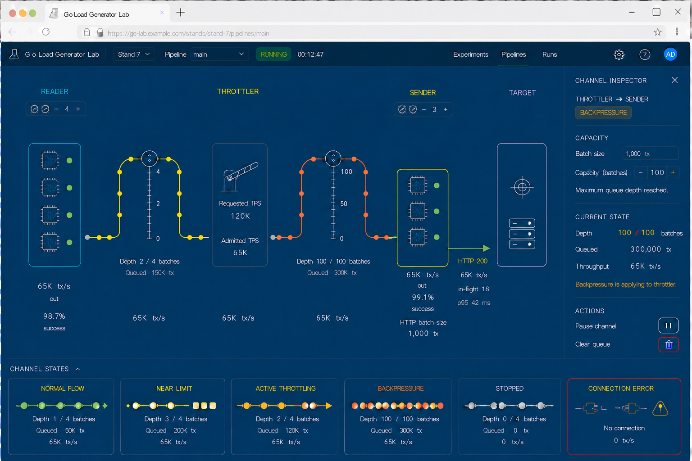

# Go Load Generator Lab: утверждённый дизайн стенда

## Статус документа

Этот файл фиксирует утверждённую UX-концепцию экспериментального стенда и ожидаемое интерактивное поведение элементов.

Изображение задаёт композицию и визуальное направление. Этот документ задаёт смысл и динамику. Если отдельная деталь изображения противоречит описанию, при реализации следует опираться на описание.

## Назначение экрана

Это основной рабочий экран load generator, а не dashboard из независимых карточек и не маркетинговая страница.

Главный объект экрана — интерактивный pipeline:

**READER → очередь 1 → THROTTLER → очередь 2 → SENDER → HTTP → TARGET**

На экране одновременно должны быть видны:

- структура pipeline;
- текущий поток данных;
- заполнение bounded-очередей;
- throttling и backpressure;
- количество worker-ов;
- ключевые показатели производительности;
- выбранный объект и его инспектор.

## Топология

В системе ровно две bounded-очереди:

1. READER → THROTTLER.
2. THROTTLER → SENDER.

Участок SENDER → TARGET является HTTP-соединением. Он не имеет queue capacity, queue depth и изменяемого изгиба.

Worker-ы внутри групп не создают отдельных линий на canvas. У каждой группы один агрегированный вход или выход, поэтому pipeline остаётся читаемым при любом количестве worker-ов.

## Общая компоновка

Названия READER, THROTTLER, SENDER и TARGET выровнены по одной верхней линии.

Основные actor-блоки выровнены по общей нижней линии. Разная высота блоков развивается вверх, не вниз.

Элементы управления количеством worker-ов располагаются отдельным рядом под названиями READER и SENDER. Они визуально относятся к заголовку группы и не прилипают к верхней границе worker-бокса.

Справа находится немодальный контекстный инспектор выбранного объекта. Нижняя панель показывает визуальный язык состояний и может быть сворачиваемой.

## Worker-группы

READER и SENDER поддерживают от 1 до 7 worker-ов.

Worker-ы анонимны. У них нет имён, номеров и индивидуальных подписей.

Пиктограмма worker-а — микросхема с небольшой линией активности внутри. Зелёный индикатор рядом показывает, что worker активен и исправен.

Высота worker-бокса вычисляется от содержимого:

- количество строк равно количеству worker-ов;
- внутренние вертикальные интервалы постоянны;
- верхний и нижний padding постоянны;
- worker-ы плотно упакованы без пустого резервного пространства;
- нижняя граница бокса остаётся закреплённой;
- при добавлении worker-а бокс растёт вверх;
- при удалении worker-а верхняя граница опускается;
- нижнее выравнивание с остальными actor-блоками не меняется.

Нажатие `+` добавляет worker-а, нажатие `−` удаляет. На границах диапазона соответствующая кнопка становится недоступной.

Изменение количества worker-ов не меняет топологию pipeline и не создаёт дополнительные кабели.

## Кабель как очередь

Каждая bounded-очередь изображается одним кабелем. Отдельного резервуара, цилиндра или дополнительного индикатора очереди нет.

Концы кабеля закреплены на соседних actor-блоках. Горизонтальное положение разъёмов и порядок actor-ов стабильны.

Кабель проходит по единственному непрерывному маршруту:

**выход upstream → подъём → верхний изгиб → спуск → вход downstream**

Под изгибом нет перемычки, обходного пути, параллельной линии или визуального ответвления.

## Изменение capacity

Capacity измеряется в batch-ах, потому что элементами Go-очереди являются batch-и.

В центре верхнего изгиба находится вертикальная drag-ручка. Пользователь может перемещать её только вверх и вниз.

Поведение ручки:

- движение вверх увеличивает capacity;
- движение вниз уменьшает capacity;
- значение изменяется дискретными шагами;
- горизонтальные координаты концов кабеля не меняются;
- кабель остаётся в своём выделенном коридоре;
- при перетаскивании показывается текущее значение capacity;
- после отпускания новое значение применяется или явно помечается как ожидающее применения.

При `capacity = 0` кабель полностью распрямляется и ложится на общую горизонтальную нулевую линию.

Кабель нельзя опустить ниже нулевой линии. Отрицательной capacity не существует.

## Шкала capacity

Шкала расположена по центру изгиба непосредственно под drag-ручкой.

Нулевая отметка шкалы точно совпадает с горизонтальным уровнем прямого кабеля при `capacity = 0`.

Шкала развивается только вверх. Ни линия шкалы, ни деления, ни подписи не располагаются ниже нуля.

Количество делений и подписей адаптируется к диапазону:

- для capacity `4` можно показать деления по одному batch-у и подписи `0`, `2`, `4`;
- для capacity `100` можно показать более плотные мелкие деления и подписи `0`, `50`, `100`;
- подписываются только major ticks;
- подписи располагаются сбоку от шкалы;
- между подписями сохраняется минимальный вертикальный интервал;
- значения не накладываются друг на друга и не пересекают кабель или маркеры.

Физическая высота шкалы ограничена canvas, поэтому числовой шаг выбирается автоматически по максимальной capacity и доступной высоте.

## Заполнение очереди

Точки на кабеле показывают элементы bounded-очереди, то есть batch-и.

Точки распределяются равномерно по всей длине кабеля. Они не скапливаются только у одного конца.

Плотность точек показывает отношение `depth / capacity`:

- низкое заполнение — редкие точки;
- приближение к пределу — более плотные точки;
- полная очередь — максимально плотное заполнение.

При большой capacity не следует рисовать каждый batch. Используется ограниченное количество репрезентативных маркеров, а точные значения показываются числом рядом с кабелем и в инспекторе.

Увеличение capacity снижает процент заполнения при неизменном depth. Оно не обещает увеличение throughput. Если input rate выше output rate, очередь снова заполнится.

## Состояния очереди

Цвет всего кабеля дискретный и одинаковый по всей длине. Градиент и смена цвета внутри одного кабеля не используются.

| Состояние | Представление |
| --- | --- |
| Normal flow | Зелёный кабель, имеется запас capacity |
| Near limit | Жёлтый кабель, очередь приближается к пределу |
| Backpressure | Красный кабель, очередь заполнена и upstream блокируется |
| Stopped | Целый серый кабель без импульса движения |
| Connection error | Разорванный или отключённый кабель со значком ошибки |

Active throttling является состоянием THROTTLER, а не состоянием очереди. Кабели около THROTTLER продолжают показывать только состояние соответствующих очередей.

## Движение и throughput

Throughput показывается точным числом в `tx/s` рядом с соответствующим участком.

Скорость движения маркеров не кодирует throughput. Допустим один спокойный импульс с постоянной скоростью как бинарный признак того, что поток идёт.

При остановке импульс исчезает. При ошибке соединение визуально разрывается.

## READER

READER читает данные из источника и формирует read batch-и.

В инспекторе READER показываются:

- количество worker-ов;
- read batch size;
- read TPS;
- количество прочитанных строк;
- источник данных;
- состояние чтения.

Read batch size независим от HTTP batch size.

## THROTTLER

THROTTLER обозначается шлагбаумом.

На самом блоке видны requested TPS и admitted TPS. Разница между ними объясняет намеренное ограничение нагрузки.

Throttling не следует изображать как ошибку TARGET или как backpressure очереди.

В инспекторе THROTTLER находятся:

- target/requested TPS;
- admitted TPS;
- pause/resume;
- текущее состояние;
- время, проведённое в ограничении.

## SENDER

SENDER преобразует поступившие транзакции в HTTP batch-и и отправляет их в TARGET.

Красная или зелёная линия не проходит насквозь блока SENDER. Очередь заканчивается на левом разъёме, а HTTP-соединение начинается с отдельного правого разъёма.

В инспекторе SENDER показываются:

- количество worker-ов;
- HTTP batch size;
- timeout;
- attempted TPS;
- in-flight requests;
- успешные и ошибочные ответы;
- retry activity.

## HTTP-участок

HTTP-участок является обычной направленной линией без изгиба и шкалы capacity.

Рядом показываются:

- HTTP status или состояние соединения;
- throughput в `tx/s`;
- in-flight requests;
- latency, включая p95.

Линия начинается на правой границе SENDER и заканчивается на левой границе TARGET. Она не проходит насквозь actor-блоки.

## TARGET

TARGET сохраняет утверждённую пиктограмму цели. Блок может быть выше других actor-ов, но его нижняя граница выровнена с общей нижней линией.

В инспекторе TARGET показываются:

- искусственная задержка;
- доля ответов 503;
- accepted TPS;
- latency;
- распределение HTTP-ответов;
- состояние доступности.

## Выбор объекта и инспектор

Нажатие на actor или кабель выбирает объект и открывает его инспектор справа. Инспектор немодальный: canvas остаётся видимым и доступным.

Выбранный объект получает спокойную контурную подсветку. Подсветка не должна менять размеры элемента или сдвигать layout.

Инспектор очереди содержит:

- input rate;
- output rate;
- throughput;
- depth в batch-ах;
- capacity в batch-ах;
- queued transactions;
- количество batch-ей;
- blocked time;
- краткий тренд depth.

Изменение capacity через drag-ручку и через инспектор синхронизировано. Оба элемента показывают одно значение.

## Применение изменений во время run

UI должен явно различать три состояния настройки:

- текущее применённое значение;
- preview во время перетаскивания;
- ожидающее применения значение.

Если backend поддерживает изменяемую bounded-очередь, capacity применяется после отпускания ручки.

Если используется обычный Go channel с неизменяемой capacity, UI не должен притворяться, что изменение уже применено. В таком случае значение помечается как применяемое при следующем run или управление временно недоступно.

Изменение количества worker-ов во время run выполняется управляемо: новый worker запускается через общий lifecycle, удаляемый worker получает сигнал завершения и корректно заканчивает текущую единицу работы.

## Responsive-поведение

Интерфейс проектируется desktop-first.

При уменьшении ширины canvas сохраняет топологию и допускает панорамирование. Инспектор на мобильном экране превращается в нижнюю панель.

Worker-боксы, кабельные коридоры, drag-ручки и подписи имеют стабильные размеры и не должны пересекаться при изменении viewport.

## Известная визуальная полировка

Текущий кадр является утверждённым направлением, но не финальным pixel-perfect макетом.

В последующих редакциях можно почистить служебные детали верхней панели, включая временный avatar `AD`, уточнить интервалы и привести подписи к единой сетке. Эти правки не меняют зафиксированную интерактивную модель.
