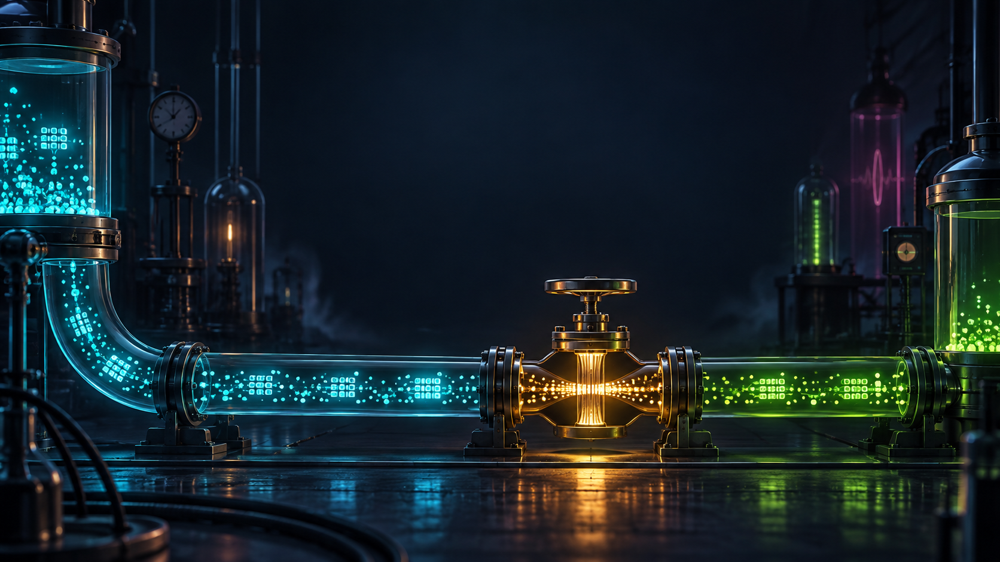
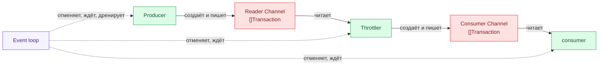
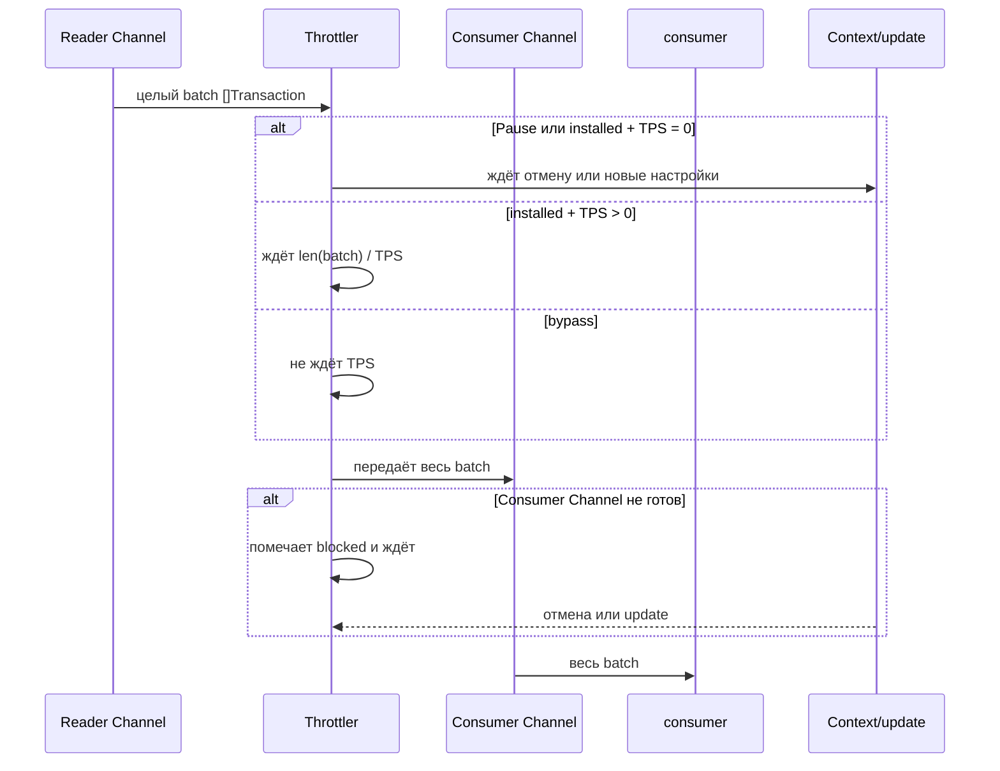
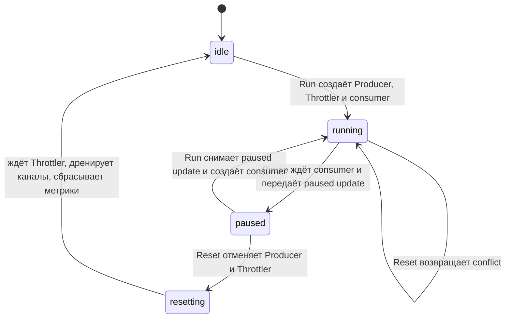

# Как сейчас работает Throttler



> 🧪 **Коротко:** Throttler не дробит batch. Он задерживает его целиком, а затем передаёт целиком дальше.

Throttler стоит между Reader Channel и Consumer Channel. Он получает готовый batch транзакций, при необходимости ждёт, а затем передаёт **тот же самый batch** дальше. Он не режет batch на отдельные транзакции и не «капает» их по одной.

Этот документ описывает текущее поведение. Оптимизация lifecycle из roadmap 3.5 здесь не предполагается уже реализованной.

## Вся цепочка



У каждого канала один владелец закрытия:

- 🟦 Producer создаёт и закрывает Reader Channel.
- 🟧 Throttler создаёт и закрывает Consumer Channel.
- 🟩 consumer только читает; он ничего не закрывает.
- 🟪 Event loop координирует остановку: отменяет владельцев, ждёт их завершения и затем дренирует каналы при Reset.

Код: [создание Reader Channel](../../producer.go#L29-L32), [создание и закрытие Consumer Channel](../../throttler.go#L19-L53), [координация event loop](../../event_loop.go#L25-L45).

## Почему кран кажется «почти закрытым»

В режиме `installed` Throttler вычисляет паузу для **целого batch**:

```go
interval := time.Duration(len(batch)) * time.Second / time.Duration(settings.requestedTPS)
```

Код: [throttler.go](../../throttler.go#L64-L95).

То есть при batch из 50 000 транзакций и настройке 200 TPS первая отправка ждёт примерно 250 секунд. При 150 TPS — примерно 333 секунды. До этой отправки Consumer Channel не получает ни одного batch, поэтому на схеме можно увидеть полностью заполненный Reader Channel и нулевой admitted flow.

> ⚠️ **Это и есть причина «перекрыл кран на чуть-чуть — всё остановилось».** При текущем размере batch шкала TPS управляет не непрерывной струёй, а ожиданием перед крупным дискретным handoff.

Это не дефект визуализации сам по себе: так устроен текущий **whole-batch limiter**. После ожидания batch отправляется целиком, а не постепенно.



После расчётной паузы Throttler сначала пытается передать batch. Если Consumer Channel не готов, он помечает blocked состояние и ждёт либо успешную отправку, либо отмену, либо update настройки. Telemetry отправки записывается только после handoff. Код: [blocked send и cancellation](../../throttler.go#L97-L125).

Режимы крана:

- 🟢 `bypass` — TPS-паузы нет.
- 🟠 `installed`, TPS больше нуля — задержка равна размеру batch, делённому на TPS.
- 🔴 `installed`, TPS равен нулю — Throttler удерживает принятый batch до Reset, Resume или изменения настройки.

Текущие defaults можно посмотреть в [config.toml](../../config.toml#L8-L14) и [config.toml](../../config.toml#L28-L39).

## Run, Pause, Resume и Reset



Что важно в текущем коде:

- ⏸️ Pause останавливает consumer и ждёт его; Producer и Throttler остаются жить.
- ▶️ Resume не создаёт новый Producer или Throttler: запускается новый consumer на прежнем Consumer Channel.
- 🧷 После подтверждённого pause-update Throttler удерживает ещё не отправленный batch. Batch, который уже оказался в буферизованном Consumer Channel до update, может там остаться.
- ♻️ Reset разрешён только из `paused`. Он отменяет Producer и Throttler, ждёт Throttler, дренирует оба канала и очищает telemetry/progress. Новый Run создаёт новую цепочку.

Код: [Run/Resume](../../event_loop.go#L109-L149), [Pause](../../event_loop.go#L150-L165), [Reset](../../event_loop.go#L166-L193), [lifecycle transitions](../../lifecycle.go#L22-L51).

## Что это означает для следующих решений

Текущий алгоритм честно ограничивает batch целиком, но из-за этого визуальная «открытость крана» не обещает равномерный поток. Прежде чем менять калибровку, надо отдельно решить: сохраняем whole-batch throttling и объясняем его UI, или меняем реальную семантику pacing.

Пункт roadmap 3.5 отдельно займётся сохранением Reader Channel и Consumer Channel при soft Reset. Это будущая работа, не свойство текущей реализации.

## Где смотреть глубже

- [Throttler](../../throttler.go)
- [Event loop](../../event_loop.go)
- [Lifecycle state machine](../../lifecycle.go)
- [Producer](../../producer.go)
- [consumer](../../consumer.go)
- [Throttler tests](../../throttler_test.go)
- [Lifecycle tests](../../event_loop_test.go)
