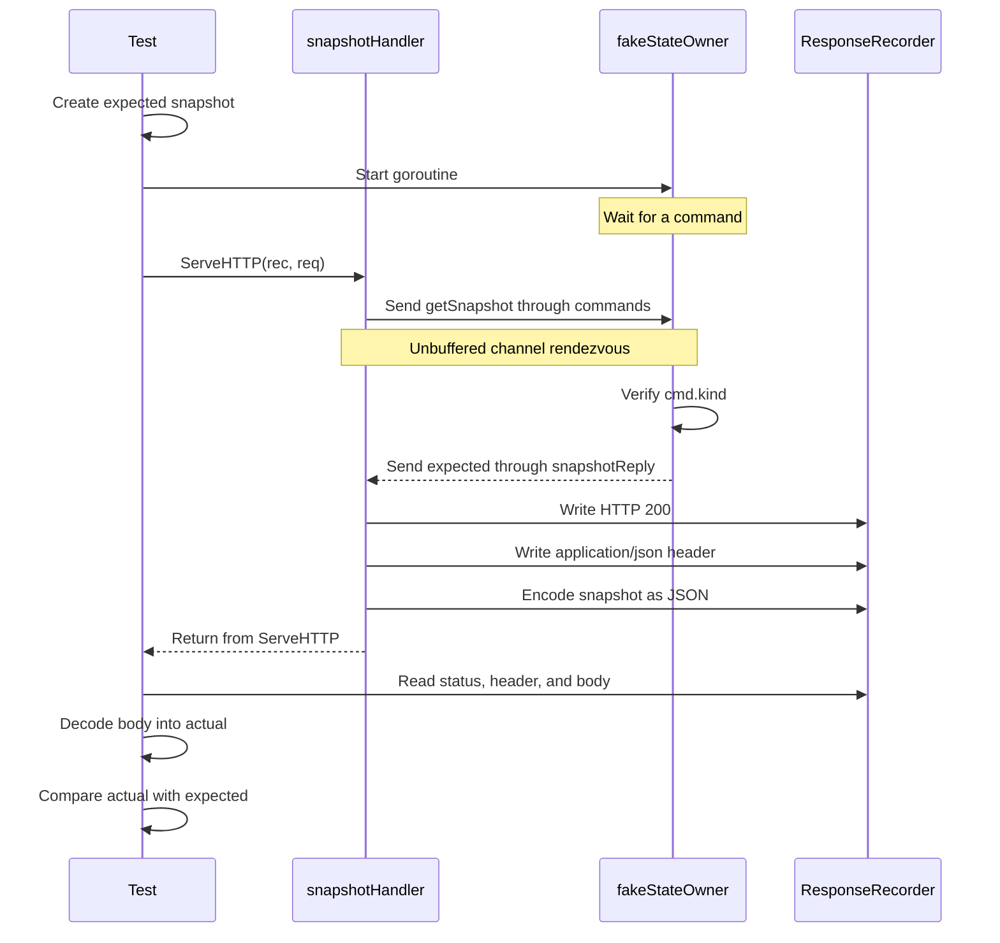

# `TestSnapshotHandlerReturnsOwnerSnapshot` sequence

This test verifies the complete snapshot request path: an HTTP request reaches `snapshotHandler`, the handler asks the state owner for a snapshot through the command channel, and the returned snapshot becomes the HTTP response.

## Participants

- `req` is the synthetic `GET /api/loadgen/snapshot` request.
- `rec` records the HTTP response produced by the handler.
- `fakeStateOwner` replaces the real state-owning `main` select loop for this test.
- `expected` is the snapshot returned by the fake state owner; it is not prebuilt JSON.
- `actual` is decoded from the handler's HTTP response body.

The goroutine is required because `snapshotHandler` sends a command and waits for `snapshotReply`. In production, the `main` select loop receives and answers that command. In this test, `fakeStateOwner` performs the same role.

